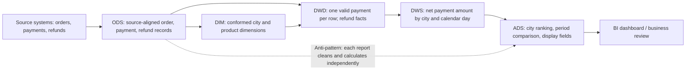

# §1 Modern Data Warehouse Layering: One Diagram from Source Data to Business Decisions

> Week 1 handout | Approximately 17 slide equivalents | About 10 minutes of speaking time  
> **Goal:** Explain the responsibilities and boundaries of ODS, DWD, DWS, and ADS; trace one complete data flow; and describe the business impact of bypassing a layer.  
> **Scope:** A typical batch data warehouse. Streaming architectures and lakehouse storage choices are outside this session.  
> **Deliverables:** One end-to-end diagram, three dos and three don'ts for each layer, and one real, publicly documented counterexample.  
> **Acceptance criteria:** Present the layering story for 10 minutes without reading a script; trace at least one path from ODS to ADS; and explain the business consequence of the counterexample.

---

## 01 | The main idea: contain changes at the right layer

Operational systems record **what happened**. A data warehouse must also answer **how the business is performing under agreed definitions**.

- **ODS** receives source data and preserves the evidence needed to trace it back.
- **DWD** turns raw records into reusable business-level detail.
- **DWS** stores reusable metrics at shared aggregation grains.
- **ADS** delivers results for a specific report, API, or analytical use case.

To place a dataset, ask three questions: **What does one row represent? Who reuses the rule? Who consumes the result?**

---

## 02 | One diagram: from payment records to a daily business report

This is a **teaching example, not a real company's schema**. Suppose we need a report of daily net payment amount by city.



**Main path: source systems → ODS → DWD → DWS → ADS → business users.** DIM supplies shared dimensions; it is not necessarily a fifth sequential step.

---

## 03 | What does each layer store for the same metric?

| Layer | Approximate grain of one row | Payment example | Main consumers |
| --- | --- | --- | --- |
| ODS | One source record or change | Raw payment and refund records | Transformation jobs and investigations |
| DWD | One well-defined business event | One valid payment or refund | Multiple analytical domains |
| DWS | One shared analytical grain | Net payment amount by city and calendar day | Multiple reports and analyses |
| ADS | One application-ready result | Today's city ranking and comparison with the previous period | BI, APIs, and operations teams |

The grain matters more than the table prefix. A table named `ads_*` is not truly an ADS dataset if each row still represents an individual payment event.

---

## 04 | ODS: preserve the source before defining business facts

The ODS reliably ingests source data and retains traceable source states or changes. It may perform necessary parsing, type checks, and technical deduplication, but it should not silently change business meaning.

| Do | Don't |
| --- | --- |
| 1. Record source, extraction time, batch ID, or change position for traceability. | 1. Treat business judgments such as “paid” or “active user” as universally accepted facts. |
| 2. Preserve source fields and meanings where possible; document full versus incremental loads. | 2. Aggregate amounts or user counts for one management report inside ODS. |
| 3. Monitor ingestion completeness, duplicate keys, and abnormal fields. | 3. Let several ADS jobs read ODS directly and repeat the same cleaning logic. |

**Boundary:** ODS answers, “What did the source send?” It does not automatically answer, “What is the approved business metric?”

---

## 05 | DWD: turn records into trusted business-level detail

Start with the business process and the **grain**. For example, say “one successful payment event per row,” rather than the vague “one row of order data.”

| Do | Don't |
| --- | --- |
| 1. Standardize statuses, currency units, time definitions, keys, and exception rules. | 1. Mix orders, payment attempts, and refunds at different grains and create double counting. |
| 2. Build reusable event-level fact tables and retain keys that trace back to ODS. | 2. Add rankings or display labels that only one report needs. |
| 3. Align with conformed dimensions and document rules for validity, cancellation, and refunds. | 3. Copy several “shared detail” tables that differ only by one status filter. |

**Boundary:** DWD decides how each event becomes a trusted fact while retaining enough detail for different analyses.

---

## 06 | DWS: calculate shared questions once

If several teams ask for “net payment amount by day and city,” define the common grain and calculation in DWS.

| Do | Don't |
| --- | --- |
| 1. Define the aggregation grain, time window, metric formula, and additivity. | 1. Give the same metric name different definitions in different DWS tables. |
| 2. Reuse DWD facts and shared dimensions for frequently needed aggregates. | 2. Reimplement payment-status cleaning and refund rules directly from ODS. |
| 3. Document refresh frequency, late-arriving data, and backfill rules. | 3. Copy a nearly identical aggregate table for every dashboard. |

**Boundary:** DWS delivers reusable shared results. If a result serves only one page, consider whether it belongs in ADS instead.

---

## 07 | ADS: deliver a specific use case

ADS is designed around how data will be consumed. It may use some redundancy for query speed and presentation, but it should inherit the agreed fact and metric definitions.

| Do | Don't |
| --- | --- |
| 1. Prepare fields, sorting, rankings, and access scope for a dashboard or API. | 1. Bypass DWD and DWS to recalculate shared metrics from ODS. |
| 2. State the refresh time, reporting period, metric version, and owner. | 2. Hide different net-amount rules in the SQL behind several pages. |
| 3. Provide stable, easy-to-query results to consumers. | 3. Make an application table the upstream source for DWD or DWS. |

**Boundary:** ADS decides how a use case consumes a metric; it should not quietly redefine what the metric means.

---

## 08 | DIM and DWM: focus on responsibilities, not just names

- **DIM** holds shared dimensions such as city, product, and organization. Consistent dimensions let DWD and DWS analyze facts under the same categories.
- **DWM** is an optional intermediate layer used by some teams for lightly transformed or subject-oriented wide tables between DWD and DWS.
- **CDM**, or common data model, is often an umbrella term for the shared model layer, which can include DWD, DWS, and dimensions.

This session uses ODS → DWD → DWS → ADS. A real project may use different labels, but the **grain, reuse boundary, and dependency direction** must still be clear. Alibaba Cloud DataWorks provides ODS, DIM, DWD, DWS, and ADS as default layers and allows teams to adapt the structure. [Source: DataWorks layering guide](https://help.aliyun.com/en/dataworks/user-guide/data-warehouse-layering)

---

## 09 | Walk the diagram: one payment becomes a daily report

1. The source systems create payment and refund changes. ODS keeps the source records and ingestion metadata.
2. DWD applies the agreed payment-status, amount-unit, and refund-linking rules to create trusted events.
3. DIM supplies a consistent city mapping. DWS aggregates valid payments and refunds by **city × calendar day** to calculate net payment amount.
4. ADS reads the DWS metric and adds the city ranking, period comparison, and display fields for the daily report.

**Speaking cue:** DWD answers, “Does this event count?” DWS answers, “What is today's total for this city?” ADS answers, “How should the report present it?”

---

## 10 | An unclear grain is a common source of double counting

Suppose one order has two payment attempts, only one succeeds, and a partial refund happens later.

- ODS may contain several order, payment-status, and refund changes.
- DWD must define payment facts and refund facts separately. A payment attempt is not automatically a completed transaction.
- DWS must specify the net-amount formula, attribution date, and how late refunds are backfilled.
- Only then should ADS rank cities by “today's net amount.”

**Discussion prompt:** Is “payments by payment date minus refunds by refund date” the same as “net amount attributed to the order date”? **No.** Their names, time rules, and intended uses must be explicit.

---

## 11 | Anti-pattern 1: using ODS as if it were DWD

**What it looks like:** Analysts or reports repeatedly filter raw ODS status codes, duplicate records, and refund changes as though ODS were already a standardized “valid payment” fact table.

**Consequence chain:** **Source field or metric definition changes → every consumer updates its own logic → reports with the same metric name diverge → business meetings spend time reconciling numbers before discussing decisions.**

**How to spot it:** Check whether DWD defines a clear business-event grain and status rules. Look for the same `CASE WHEN` logic repeated across consumer queries.

---

## 12 | Anti-pattern 2: ADS reads directly from ODS

**What it looks like:** To ship a daily report quickly, an application table directly reads source-aligned order tables and performs deduplication, status mapping, refund calculations, and city aggregation itself.

- **At first:** One report may produce a plausible number.
- **As usage grows:** A second report repeats the cleaning logic; a third changes one rule. When the upstream status changes, fixes are scattered across consumers.
- **Business impact:** Reports disagree, incidents take longer to investigate, delivery becomes less predictable, and managers have trouble choosing which figure to trust.

Alibaba Cloud MaxCompute's layer-access guidance requires ADS to read through the common model layer. It identifies redundant processing, inconsistent results, and maintenance difficulty as consequences of bypassing layers. [Source: MaxCompute layer-access guidance](https://www.alibabacloud.com/help/en/maxcompute/user-guide/specify-the-principles-for-using-data-at-different-layers)

---

## 13 | Real counterexample: summary datasets read ODS directly

**Public case, anonymized in the narrative:** In a published retrospective, the data-platform lead of an internet company described a warehouse where many summary datasets read raw data directly and many jobs and queries accessed ODS. The same retrospective reported **inconsistent business definitions, data sources, and calculation logic** across data products, leading to different values for supposedly identical metrics. Data was also sometimes late, drawing complaints from business users. [First-hand retrospective](https://www.cnblogs.com/163yun/p/12016727.html)

| What the source directly reports | Why it matters to the business |
| --- | --- |
| Summary datasets and many queries directly used ODS. | A weak shared detail layer makes downstream teams more likely to repeat cleaning and spend more effort tracing discrepancies. This is an inference from the dependency pattern. |
| The same metric could return different values because definitions, sources, and calculations differed. | Business users first have to reconcile the definitions before acting on the number. |
| Data was sometimes late, and business users complained about exceptions. | Reports were not consistently available when needed. |

**Evidence boundary:** The retrospective does not say that cross-layer access alone caused every delay or complaint, and it does not publish SQL for a specific table. No table names, incident duration, or monetary losses have been invented here. What it does establish is that direct ODS access, metric inconsistency, and business complaints existed in the same environment; layering was part of the subsequent governance work.

---

## 14 | Where did the real case cross the boundary?

```text
Problem pattern: a summary of the published observations
ODS raw records ──────────────────→ summary datasets / many queries → data products
                   shared detail definitions are bypassed

Recommended direction: a teaching interpretation
ODS raw records → DWD business facts → DWS shared metrics → ADS use-case delivery
```

Here is one way to explain the misplaced logic: **Status standardization and deduplication were left to summary jobs or application queries, even though reusable business detail should be defined in the shared detail layer. Reusable metrics spread across application tables should move into shared aggregation or a common metric definition.**

The published retrospective says the organization later eliminated direct ODS references from summary datasets and improved table reuse. This does **not** mean that forcing every layer to materialize a physical table would solve the underlying problem. [Source: published retrospective](https://www.cnblogs.com/163yun/p/12016727.html)

---

## 15 | Find duplicate work by comparing logic, not only table names

| Observation | What to inspect | Possible home |
| --- | --- | --- |
| Several ADS tables repeat the same payment-status rule | Is the status mapping standardized in DWD? | Shared event-level fact |
| Different dashboards each have a “city daily net amount” table | Are grain, refund date, and amount rules identical? | Shared DWS metric; separate ADS presentation |
| A summary table reads raw refund records from ODS | Is DWD missing a refund fact or linking key? | Complete DWD before aggregating |
| Several DWS tables differ only by an organization level | Can they reuse a dimension relationship? | Shared dimension or bridge relationship |

Check **lineage, grain, metric definition, and consumers** before merging tables. Similar names alone do not prove that two datasets are interchangeable.

---

## 16 | Layering does not require four physical tables for every request

The four layers describe responsibilities and dependency direction; they are not a mandate to add jobs to every low-reuse requirement. A small exploratory use case may consume DWD directly. When a metric becomes common to several consumers, it can be promoted into DWS. The important boundary is that each application should not repeat raw-data cleaning.

Close with three questions:

1. **Will we need to reconstruct what the source sent?** If so, keep ODS source and batch metadata.
2. **Will several requirements share this rule?** Put shared event facts in DWD and shared-grain metrics in DWS.
3. **Does the output only serve one use case?** Put its application-specific shape in ADS.

---

## 17 | Ten-minute speaking route and self-check

| Time | Content | One sentence to deliver |
| --- | --- | --- |
| 0–1 min | Slides 01–02: overview and diagram | Data moves from source systems to business decisions, gaining a clearer meaning at each layer. |
| 1–5 min | Slides 03–09: responsibilities and full path | ODS preserves source records; DWD defines facts; DWS defines shared aggregates; ADS serves use cases. |
| 5–7 min | Slides 10–12: grain and two anti-patterns | Without shared detail, cleaning and metric rules spread across downstream applications. |
| 7–9 min | Slides 13–15: real case and duplicate work | The business experiences conflicting numbers, slower investigation, and less predictable delivery. |
| 9–10 min | Slide 16: boundaries and wrap-up | Layer by responsibility, not by the number of tables. |

**Self-check without notes:**

1. Point to Slide 02 and trace one payment record to the daily report. Name one transformation added at each layer.
2. Where do “one successful payment per row” and “one city-day per row” belong, and why?
3. Use Slide 13 to explain the business impact of a misplaced transformation, beyond saying that it violates an architectural rule.

---

## Interview-ready 90-second answer

> I use warehouse layers to separate source preservation, business definitions, shared metrics, and application delivery. In a typical flow, ODS keeps source-aligned records and ingestion metadata. DWD turns them into trusted event-level facts, with explicit rules for statuses, duplicates, and refunds. DWS aggregates those facts at a shared grain, such as net payment amount by city and day. ADS then shapes the result for a dashboard or API, adding things like rankings and display fields. The key design question is what one row represents and where a rule should be reused. If an ADS report reads ODS directly, each report may implement its own cleaning logic. That can lead to conflicting numbers and slow investigations when source data or metric definitions change. I would inspect lineage and repeated transformations, define the event grain in DWD, move reusable metrics into DWS, and let ADS focus on the consuming use case. I would not insist on four physical tables for every request; the boundaries and definitions matter more than the table count.

---

## Further reading and source notes

- [Alibaba Cloud DataWorks: Data warehouse layering](https://help.aliyun.com/en/dataworks/user-guide/data-warehouse-layering): responsibilities of each layer and DIM.
- [Alibaba Cloud MaxCompute: Layer-access guidance](https://www.alibabacloud.com/help/en/maxcompute/user-guide/specify-the-principles-for-using-data-at-different-layers): consequences of bypassing shared layers.
- [Published data-platform retrospective](https://www.cnblogs.com/163yun/p/12016727.html): factual basis for Slides 13–14. The company is anonymized in the teaching narrative, while the public source remains linked for verification.
- Chapter 1 of Kimball's *The Data Warehouse Toolkit* is useful background on dimensional modeling. This handout's **ODS/DWD/DWS/ADS terminology and access rules** come from the linked public sources; they are not attributed to Kimball.

> Instructor note: If you later replace Slides 13–14 with a case from your own work, retain four elements: the original dependency path, the misplaced logic, the business consequence, and the evidence boundary. Do not add unverified losses, incident durations, or causal claims.
