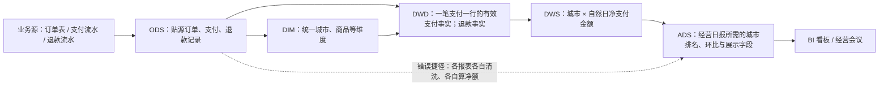

# §1 现代数仓分层：一张图讲清数据从哪来到哪去

> 第 1 周讲义｜约 17 页幻灯片粒度｜主讲约 10 分钟  
> 目标：能说明 ODS、DWD、DWS、ADS 的职责与边界，沿一条链路讲清数据如何变成业务指标，并识别跨层引用的业务后果。  
> 范围：以批量数仓的典型链路为主；实时计算、湖仓存储选型不在本节展开。  
> 交付：一张完整链路图、每层 3 条“该做/不该做”、一个有公开出处的真实反例。  
> 验收：不看稿讲 10 分钟；图上能从 ODS 追到 ADS；反例能回答“业务为什么会受影响”。

---

## 01｜先给结论：分层是为了让变化停在该停的地方

业务系统记录“发生了什么”；数仓需要进一步回答“按统一口径，业务表现如何”。

- **ODS** 接住源数据，保留追溯依据。
- **DWD** 把原始记录整理成可复用的业务明细。
- **DWS** 在共同粒度上沉淀可复用的汇总指标。
- **ADS** 为具体报表、接口或分析场景交付结果。

判断是否分对层，先问三个问题：**这一行代表什么粒度？规则由谁复用？谁直接消费？**

---

## 02｜一张图：从订单记录到经营日报

以下为**教学示例，不对应任何真实公司或真实表名**。假设要做“各城市每日净支付金额”报表。



**主线：源系统 → ODS → DWD → DWS → ADS → 使用者。** DIM 是共享维度，不是必须排成第五个串行步骤。

---

## 03｜同一个指标，四层各保存什么

| 层 | 这一行大致代表什么 | 订单示例 | 面向谁 |
| --- | --- | --- | --- |
| ODS | 一条源系统记录或变更 | 原始支付流水、退款流水 | 加工任务、追溯排障 |
| DWD | 一个明确的业务事件 | 一笔有效支付、一次有效退款 | 多个分析主题的公共明细 |
| DWS | 一个共同分析粒度 | 城市 × 自然日的净支付金额 | 多个报表或分析需求 |
| ADS | 一个应用需要的结果 | 今日城市榜单及环比 | BI、接口、运营人员 |

“一行是什么”比表名前缀更重要。`ads_` 开头却仍是一笔支付一行，并不会自动成为 ADS。

---

## 04｜ODS：保留来源，不抢着定义业务事实

ODS 的工作是稳定接入并保留可追溯的原始状态或变更。它可以做必要的格式解析、类型校验和技术去重，但不能悄悄改写业务含义。

| 该做 | 不该做 |
| --- | --- |
| 1. 记录来源、抽取时间、批次或变更位置，便于追溯。 | 1. 把“已支付”“有效用户”等业务判断直接固化成通用事实。 |
| 2. 尽量保留源字段及原始语义，明确全量/增量方式。 | 2. 为某张经营报表在 ODS 中直接聚合金额和人数。 |
| 3. 对接入完整性、主键重复和字段异常做监测。 | 3. 让多个 ADS 各自直接读取 ODS 并重复清洗。 |

**边界句**：ODS 能回答“源头传来了什么”，不能天然回答“业务认可的指标是多少”。

---

## 05｜DWD：把记录变成可信的业务明细

先确定业务过程与**粒度**：例如“一笔成功支付事件一行”，而不是含糊地说“一行订单数据”。

| 该做 | 不该做 |
| --- | --- |
| 1. 统一状态、金额单位、时间口径、主键和异常处理规则。 | 1. 混放订单、支付、退款等不同粒度，导致重复计数。 |
| 2. 按业务事件建可复用的明细事实，保留追溯到 ODS 的键。 | 2. 只为单个报表放入排名、展示文案等应用逻辑。 |
| 3. 与一致性维度对齐，并写清有效、撤销、退款等判定。 | 3. 复制多张只差一个状态过滤条件的“公共明细”。 |

**边界句**：DWD 统一“每件事如何被算作事实”，仍保留足够明细供不同分析复用。

---

## 06｜DWS：把公共问题提前算一次

当多个使用者都问“按天、按城市的净支付金额”，把共同粒度和共同口径沉到 DWS。

| 该做 | 不该做 |
| --- | --- |
| 1. 明确汇总粒度、统计窗口、指标口径与可加性。 | 1. 在不同 DWS 表中分别定义同名“净支付金额”。 |
| 2. 复用 DWD 事实和共享维度，沉淀高频公共汇总。 | 2. 直接从 ODS 重做支付状态清洗和退款判定。 |
| 3. 记录刷新频率、迟到数据与回补规则。 | 3. 为每个看板复制一张几乎一样的汇总表。 |

**边界句**：DWS 交付的是公共可复用结果；若只服务单一页面，先判断是否应该放 ADS。

---

## 07｜ADS：交付一个明确的使用场景

ADS 面向消费方式设计，允许为查询速度和展示需求做适量冗余，但仍应继承已约定的事实与指标口径。

| 该做 | 不该做 |
| --- | --- |
| 1. 按看板或接口要求准备字段、排序、排名和权限范围。 | 1. 绕过 DWD/DWS，直接从 ODS 重算公共指标。 |
| 2. 标清更新时间、时间范围、口径版本与负责人。 | 2. 把本应复用的净额判定分别藏在多个页面 SQL 中。 |
| 3. 对外提供稳定、易查询的消费结果。 | 3. 让应用表反向成为 DWD 或 DWS 的基础来源。 |

**边界句**：ADS 可以适配“这个场景怎么用”，不应私自改写“这个指标是什么”。

---

## 08｜DIM 与 DWM：遇到不同命名，先看职责

- **DIM**：共享维度，例如城市、商品、组织。维度口径统一后，DWD/DWS 才能按相同分类分析。
- **DWM**：有些团队在 DWD 与 DWS 之间设置轻度加工或主题宽表层。它是可选设计，不是四层链路缺了就不完整。
- **CDM**：常用来统称公共数据模型层，其中可包含 DWD、DWS 和维度。

课上统一用 ODS → DWD → DWS → ADS；在项目里允许不同命名，但必须能说清**粒度、复用对象、依赖方向**。阿里云 DataWorks 的默认层级包含 ODS、DIM、DWD、DWS、ADS，同时允许按团队方法调整。[来源：DataWorks 分层说明](https://help.aliyun.com/en/dataworks/user-guide/data-warehouse-layering)

---

## 09｜沿图讲一次：一笔支付怎样走到日报

1. 源系统产生支付、退款变更；ODS 保留原记录和抽取信息。
2. DWD 按约定把支付状态、金额单位、退款关联统一成可信事件。
3. DIM 提供同一套城市归属；DWS 按“城市 × 自然日”汇总有效支付额与退款额，计算净额。
4. ADS 从 DWS 取净额，补城市排名、环比、展示字段，供经营日报读取。

**讲述重点**：DWD 解决“这笔算不算”；DWS 解决“这个城市今天合计多少”；ADS 解决“报表怎样呈现”。

---

## 10｜粒度不清，是最常见的重复计数起点

假设一个订单有两笔支付尝试，其中一笔成功；后来发生一次部分退款。

- ODS 可能有多条订单、支付状态和退款变更记录。
- DWD 必须分别定义支付事实与退款事实，不能把支付尝试当成成交笔数。
- DWS 必须说明净支付金额的公式、归属日期及退款回补方式。
- ADS 才能对“今日净额”做排名。

**课堂追问**：若支付按支付日、退款按退款日，和“订单归属日净额”是不是同一个指标？答案是**不是**；名称、时间口径和用途必须写清。

---

## 11｜反模式一：把 ODS 当 DWD 用

表现：分析师或报表直接对 ODS 的原始状态码、重复记录、退款变更写过滤规则，仿佛它已经是统一的“有效支付明细”。

后果链：**源字段变化或口径调整 → 每个消费方分别修改 → 同名指标结果分叉 → 经营会议先核数，后讨论决策。**

识别办法：查看 DWD 是否有明确的业务事件粒度和状态规则；查看多个消费 SQL 是否重复出现同一段 `CASE WHEN`。

---

## 12｜反模式二：ADS 直接连 ODS

表现：为赶日报上线，让应用表直接从贴源订单表做去重、状态翻译、退款计算和城市汇总。

- **短期**：一张报表也许能出数。
- **扩大后**：第二张报表再写一遍清洗，第三张又改一个口径；上游状态改变时，修复散落在多处。
- **业务后果**：数字相互矛盾、问题定位慢、交付时间不稳定，管理者难以确定采用哪个版本。

阿里云 MaxCompute 的层间调用规范明确要求 ADS 通过公共模型层取数，并说明跳层会带来重复加工、结果不一致和维护困难。[来源：MaxCompute 层间调用规范](https://www.alibabacloud.com/help/en/maxcompute/user-guide/specify-the-principles-for-using-data-at-different-layers)

---

## 13｜真实反例：汇总层直引 ODS，业务为何受影响

**公开案例，叙述脱敏**：某互联网公司的数据平台负责人在公开复盘中提到，治理前存在“大量汇总层数据直接引用原始数据”、ODS 被大量任务和查询直接使用；同时，不同数据产品的**指标业务口径、数据来源、计算逻辑不一致**，出现同名指标结果不同。数据还曾无法稳定按约定时间产出，引发业务方投诉。[一手公开复盘](https://www.cnblogs.com/163yun/p/12016727.html)

| 原文直接支持的事实 | 对业务的可解释影响 |
| --- | --- |
| 汇总层直引 ODS、许多查询直扫原始数据。 | 复用的公共明细不足；每个下游更容易重复清洗，查数与排障成本上升。后半句是基于链路的推论。 |
| 同一指标曾因口径、来源、计算逻辑不同而结果不一。 | 业务方无法直接对齐一份经营数字，需要先核对定义。 |
| 数据曾不能按时产出，异常引发投诉。 | 报表到达时间不稳定，影响按时使用数据。 |

**证据边界**：公开复盘没有声称“跨层引用单独造成所有延迟与投诉”，也没有给出具体某张表的 SQL。这里不虚构表名、数值或事故时间。可确认的是：该平台确实出现了跨层直取 ODS、指标不一致和业务投诉；分层治理是其后续改进的一部分。

---

## 14｜把反例放回图里：具体哪里越界了

```text
问题链路（公开案例所述现象的概括）
ODS 原始记录 ───────────────→ 汇总层 / 大量查询 → 多个数据产品
                  跳过统一明细口径

推荐治理方向（教学归纳）
ODS 原始记录 → DWD 业务事实 → DWS 共同指标 → ADS 场景交付
```

“该放错哪层”可以这样说：**需要统一状态和去重的逻辑被留给汇总层或应用查询，实际上应在公共明细层沉淀；可复用指标若散落在各应用表，应回到公共汇总或统一指标定义。**

该公开复盘描述，治理后消除了“汇总数据直接引用 ODS”的情况，并提升数仓表复用性。不要把它理解为“只要强制每层落一张物理表，问题就自动解决”。[来源：公开复盘](https://www.cnblogs.com/163yun/p/12016727.html)

---

## 15｜发现重复建设：看逻辑，而不只看表名

| 观察到的现象 | 应检查什么 | 可能的归位 |
| --- | --- | --- |
| 多张 ADS 都写相同支付状态判定 | 状态映射是否已在 DWD 统一 | 公共明细事实 |
| 不同看板各有一张“城市日净额” | 粒度、退款日期与金额口径是否一致 | 共用 DWS，ADS 各自适配展示 |
| 汇总表又直读 ODS 退款流水 | DWD 是否缺退款事实或关联键 | 补 DWD 后再汇总 |
| 多张 DWS 仅多一个组织层级字段 | 是否有可复用的维度关系 | 优先改共享维度或桥接关系 |

先查**血缘、粒度、口径、消费方**，再决定合并；名字相近不代表可以直接合并。

---

## 16｜分层不是“每个请求必须走满四张物理表”

四层是职责与依赖方向，不是让低复用需求机械增加作业。小规模探索可能先从 DWD 进入应用消费；若共同指标被多处使用，再沉淀 DWS。关键是不要让每个应用重做原始数据清洗。

用三个判断收束：

1. **是否需要还原源头？** 需要就保留 ODS 的来源与批次。
2. **规则是否被多个需求共享？** 共享事实放 DWD，共享粒度的指标放 DWS。
3. **是否只为一个使用场景服务？** 场景形态放 ADS。

---

## 17｜10 分钟讲述路线与现场验收

| 时间 | 讲什么 | 必须说清的一句话 |
| --- | --- | --- |
| 0–1 分钟 | 第 01–02 页：总览和图 | 数据从源系统走到业务决策，层层增加确定的含义。 |
| 1–5 分钟 | 第 03–09 页：四层职责与完整链路 | ODS 保真，DWD 定事实，DWS 定公共汇总，ADS 交付场景。 |
| 5–7 分钟 | 第 10–12 页：粒度与两种越界 | 跳过公共明细，清洗和口径就会散落在下游。 |
| 7–9 分钟 | 第 13–15 页：真实反例与重复建设 | 业务最终面对的是数字不一致、查数慢和交付不稳定。 |
| 9–10 分钟 | 第 16 页：边界与收束 | 分层按职责，不按表数量。 |

**自测，不看稿回答：**

1. 指着第 02 页，从一笔支付记录讲到经营日报，每层说出一项新增处理。
2. 给出“一笔支付一行”和“城市 × 日一行”，分别归到哪层，为什么？
3. 用第 13 页反例解释：错层为何会影响业务，而不仅是代码不规范？

---

## 延伸阅读与使用说明

- [阿里云 DataWorks：数仓分层](https://help.aliyun.com/en/dataworks/user-guide/data-warehouse-layering)：用于对照各层职责与 DIM。
- [阿里云 MaxCompute：层间调用规范](https://www.alibabacloud.com/help/en/maxcompute/user-guide/specify-the-principles-for-using-data-at-different-layers)：用于理解跨层调用为何造成重复加工与口径风险。
- [某互联网公司数据中台建设公开复盘](https://www.cnblogs.com/163yun/p/12016727.html)：第 13–14 页真实反例的事实来源；正文已对公司名称做脱敏。
- Kimball《数据仓库工具箱》第 1 章可作为维度建模的延伸阅读；本讲义的 **ODS/DWD/DWS/ADS 层名与调用规则**依据上述公开资料，不将四层命名归因于 Kimball。

> 教师备注：若以后取得自己的项目案例，替换第 13–14 页时保留“原始链路、错层位置、业务后果、证据边界”四项；未核实的损失金额、事故时长和因果关系不要补写。
